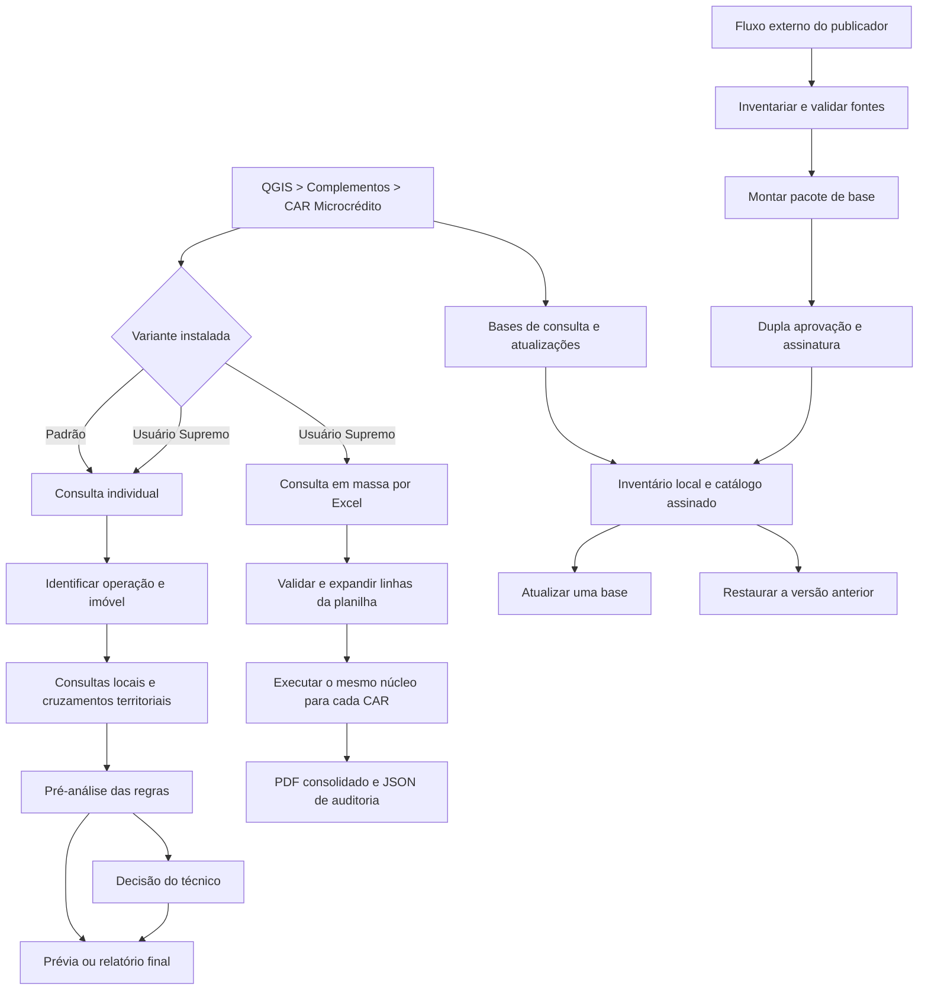
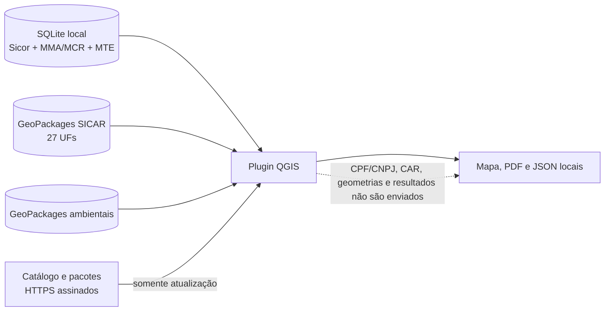
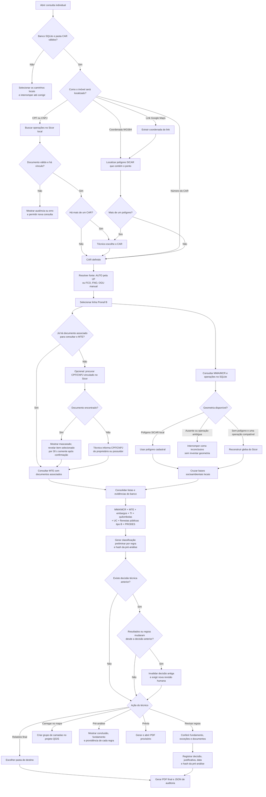
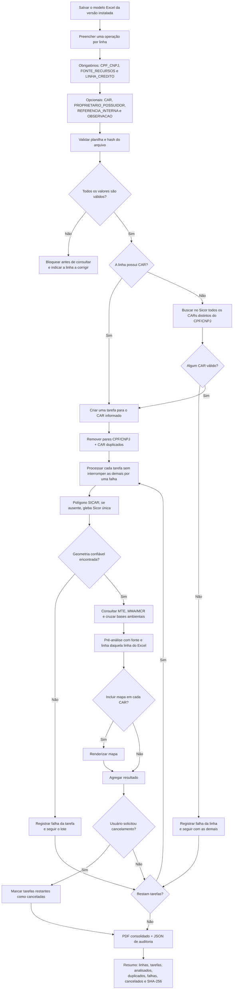
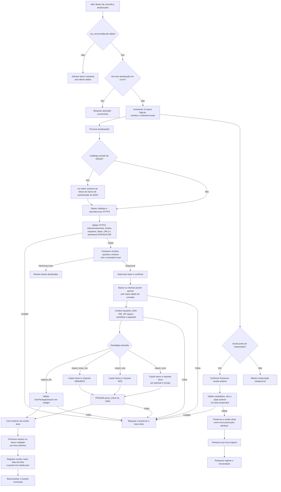
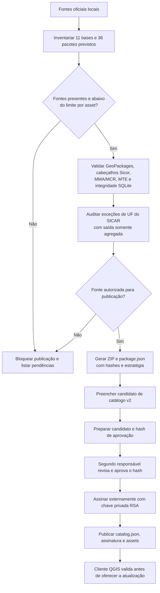
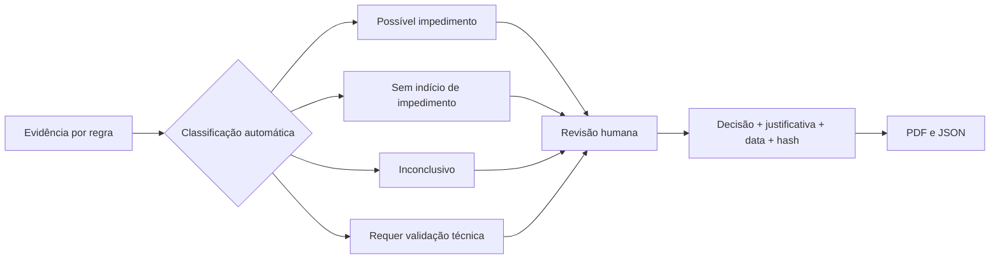

# Fluxograma funcional do CAR Microcrédito 0.9.4

Este documento descreve os caminhos da aplicação e os limites entre a
pré-análise automática e a decisão humana. A variante padrão abre a consulta
individual. A variante Usuário Supremo abre a consulta em massa e mantém a
consulta individual como opção separada. Ambas compartilham o mesmo núcleo de
consulta, regras, relatório e atualização.

Os fluxos abaixo cobrem todas as rotas funcionais expostas pelo plugin. Falhas
de validação, arquivo ausente, catálogo inválido ou cancelamento convergem para
um estado seguro: a operação é interrompida, o motivo é apresentado e a base
ativa não é substituída.

## 1. Mapa geral

## 2. Consulta individual

Observações:

- a consulta de CPF/CNPJ por CAR usa somente o Sicor local e não prova
  titularidade atual;
- se nenhum documento for encontrado, o técnico informa o CPF/CNPJ do
  proprietário ou possuidor para a consulta MTE;
- a ferramenta aponta possível impedimento, ausência de indício, lacuna ou
  necessidade de validação. A contratação continua sendo decisão humana;
- a decisão fica vinculada ao hash da pré-análise e é invalidada se a
  pré-análise mudar.

## 3. Consulta em lote

### Interação dos novos campos

| Campo | Consulta individual | Consulta em lote | Saída |
|---|---|---|---|
| Fonte de recursos | sugestão pela UF ou escolha manual | `FONTE_RECURSOS` com AUTO, FCO, FNO ou OGU | pré-análise, PDF e JSON, incluindo o modo de seleção |
| Linha de crédito | lista fechada na tela | `LINHA_CREDITO` por linha, com lista suspensa | pré-análise, PDF e JSON |

As combinações não são escolhidas uma única vez para o lote. Isso permite,
por exemplo, que uma linha seja FNO/Pronaf B e outra seja OGU/Pronaf B para
mulheres sem mistura de contexto. OGU é tratado como fonte de recursos, não
como fundo constitucional.

## 4. Pesquisa, aplicação e restauração de atualizações

A busca de atualizações envia ao publicador somente requisições do catálogo
e do pacote selecionado. CPF/CNPJ, CAR, geometrias e resultados de consulta não
são enviados ao GitHub. A restauração é integralmente local.

## 5. Preparação e publicação de uma atualização

A chave privada permanece fora do Git, do OneDrive e do ZIP do plugin. O Sicor
possui uma barreira adicional de custódia: a existência técnica dos arquivos
não autoriza seu espelhamento.

## 6. Resultado automático e decisão humana

A aplicação nunca converte a pré-análise em aprovação ou recusa de
crédito. Uma mudança nas evidências ou nas regras altera o hash e invalida a
decisão anterior para nova revisão.

## 7. Responsabilidade de cada componente

| Componente | Responsabilidade |
|---|---|
| QGIS e janelas do plugin | entrada, escolha, progresso, mapa e mensagens |
| SQLite Sicor/MMA/MTE | operações, vínculos e listas importadas |
| SICAR e bases ambientais locais | geometria e cruzamentos territoriais |
| Motor de pré-análise | organizar evidências e indicar conclusão preliminar |
| Técnico de crédito | conferir documentos, exceções, enquadramento e decidir |
| Publicador central | assinar e disponibilizar catálogo e pacotes autorizados |
| Atualizador local | validar, preservar a versão anterior e promover a nova base |

## 8. Saídas e estados finais

| Caminho | Saída normal | Saída segura em falha/cancelamento |
|---|---|---|
| Consulta individual | camadas QGIS, pré-análise, PDF e JSON | mensagem objetiva; nenhum resultado é inventado |
| Consulta em lote | PDF consolidado e JSON com hash da planilha | relatório parcial com falhas, duplicados e cancelados |
| Consulta CPF/CNPJ por CAR | documentos mascarados; revelação temporária confirmada | nenhum documento exportado ou registrado em log |
| Atualização | base promovida e versão registrada | base ativa preservada; estágio temporário removido |
| Restauração | versão anterior ativa e novo ponto para desfazer | versão atual preservada |
| Publicação | catálogo e pacotes assinados | publicação bloqueada diante de fonte, aprovação ou assinatura inválida |
