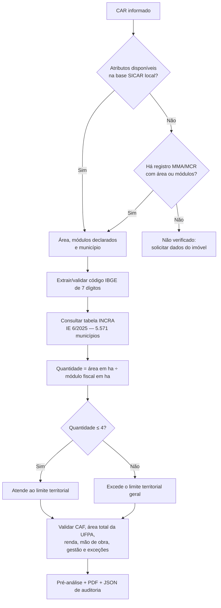

# Módulos fiscais e agricultura familiar — versão 0.9.5

## Resultado implementado

A versão 0.9.5 associa o código IBGE extraído do CAR ao módulo fiscal do
município, calcula a quantidade de módulos pela área do imóvel e apresenta um
dos três resultados: `atende_limite`, `nao_atende_limite` ou `nao_verificado`.

O resultado não declara automaticamente que o beneficiário é agricultor
familiar. O limite de quatro módulos é somente um dos requisitos gerais; o
técnico ainda precisa validar CAF ativo, área total da unidade familiar de
produção agrária (UFPA), mão de obra, renda, gestão e exceções legais.

## Fontes oficiais

- [Módulo Fiscal — INCRA](https://www.gov.br/incra/pt-br/assuntos/governanca-fundiaria/governanca-fundiaria/modulo-fiscal)
- [Instruções Especiais vigentes — INCRA](https://www.gov.br/incra/pt-br/centrais-de-conteudos/legislacao/instrucao-especial)
- [IE INCRA nº 6/2025 e Anexo IV republicado — DOU](https://www.in.gov.br/web/dou/-/instrucao-especial-incra-n-6-de-4-de-julho-de-2025-640263739)
- [Lei nº 11.326/2006 — Planalto](https://www.planalto.gov.br/ccivil_03/_ato2004-2006/2006/lei/l11326.htm)
- [Cadastro Nacional da Agricultura Familiar — MDA](https://www.gov.br/mda/pt-br/acesso-a-informacao/copy_of_acoes-e-programas/caf/o-que-e-o-caf)

## Fluxo da consulta

## Persistência e atualização

O núcleo distribuído contém um retrato compacto da tabela oficial para que a
consulta funcione com o banco atual aberto em modo somente leitura. A migração
do esquema v4 materializa os mesmos 5.571 registros na tabela
`incra_modulo_fiscal`, guardando norma, URL e data de referência. Uma mudança
normativa futura deve substituir o retrato, atualizar a referência e gerar nova
migração, preservando a rastreabilidade do relatório.
